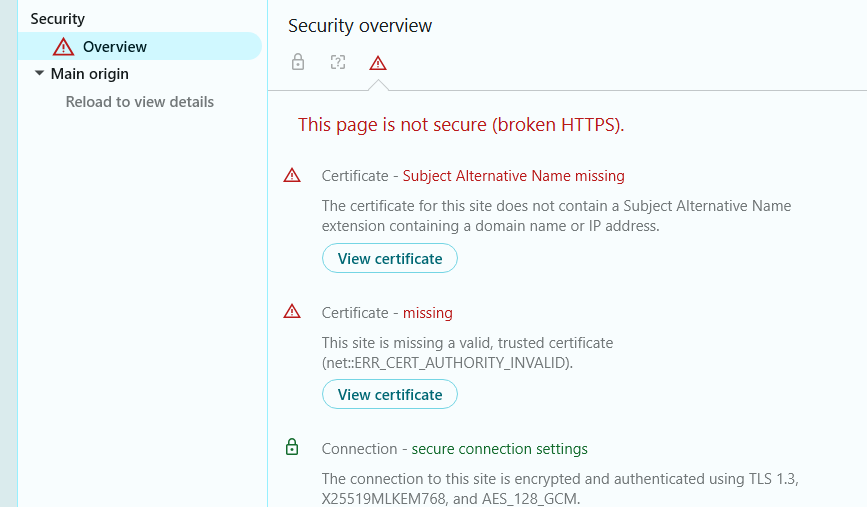
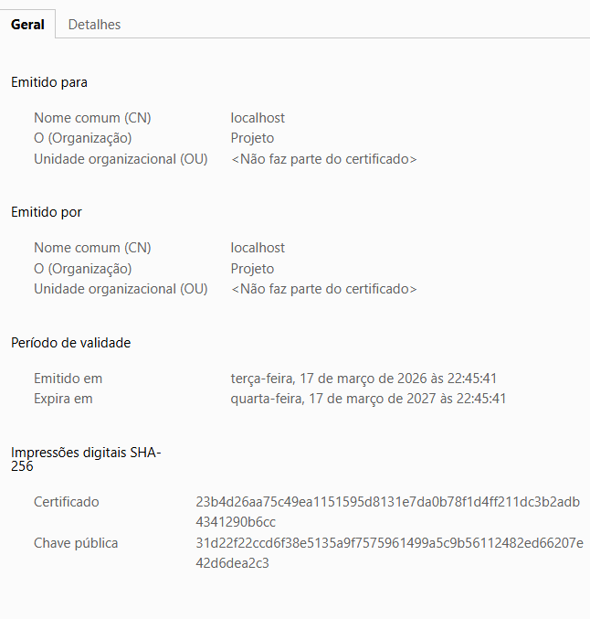

# Joomla HTTPS com Docker & Nginx 🔒


## 🎯 Objetivo do Projeto
Este projeto implementa uma infraestrutura web segura utilizando **Joomla** e banco de dados **MySQL**, isolados em contêineres Docker. A porta de entrada é gerenciada por um servidor web **Nginx** atuando como proxy reverso, configurado com políticas de segurança rigorosas.

### Requisitos Técnicos Atendidos:
1. **Redirecionamento Automático:** Todo acesso HTTP (porta 80) é forçado para HTTPS (porta 443).
2. **Protocolo Seguro:** O servidor aceita **exclusivamente** conexões via protocolo `TLS 1.3`.
3. **Criptografia Forte:** Utilização de um certificado digital autoassinado com tamanho de chave de **4096 bits (RSA)**.

---

## 📂 Estrutura de Diretórios
```text
joomla-https/
├── docker-compose.yml     # Orquestração dos contêineres (App, Banco e Nginx)
├── README.md              # Documentação do projeto
└── nginx/
    ├── nginx.conf         # Regras de servidor e políticas TLS 1.3
    └── certs/             # Diretório onde os certificados SSL devem ser alocados
        ├── server.crt     # Certificado autoassinado (gerado pelo usuário)
        └── server.key     # Chave privada (gerada pelo usuário)
```

 *(Atenção: Os arquivos `server.crt` e `server.key` não são versionados devido a questões de segurança. Eles devem ser gerados localmente no momento da instalação).*

---

## 🚀 Passo a Passo de Instalação

### Pré-requisitos
* [Docker](https://www.docker.com/) instado (Docker Desktop / Docker Engine)
* [Git Bash](https://gitforwindows.org/) (no Windows, para usar o OpenSSL) ou terminal Linux/Mac.

### 1. Clonar o repositório
```bash
git clone https://github.com/hem-chrsz/Certificado-digital-autoassinado-em-servidor-web-com-Nginx..git
cd Certificado-digital-autoassinado-em-servidor-web-com-Nginx.
```

### 2. Gerar o Certificado SSL Autoassinado (RSA 4096 / TLS 1.3)
Dentro da raiz do projeto (`joomla-https`), abra o terminal (se estiver no Windows, use o Git Bash) e execute:
```bash
MSYS_NO_PATHCONV=1 openssl req -x509 -nodes -days 365 -newkey rsa:4096 -keyout nginx/certs/server.key -out nginx/certs/server.crt -subj '/C=BR/ST=TO/L=Palmas/O=Projeto/CN=localhost'
```
*Isso irá gerar a chave e o certificado exigidos, validos por 1 ano, diretamente na pasta `nginx/certs/`.*

### 3. Subir a Infraestrutura
Com os certificados no lugar correto, execute a orquestração do Docker Compose:
```bash
docker compose up -d
```
*O Docker irá baixar as imagens do Nginx, MySQL e Joomla, e ligar todos os serviços.*

---

## ⚙️ Configuração Inicial do Joomla (Primeiro Acesso)
Após a subida dos contêineres, acesse `https://localhost` no seu navegador. Como o certificado é autoassinado, o navegador exibirá um alerta ("Sua conexão não é particular"). Clique em **Avançado > Ir para localhost (inseguro)**.

### Dados Necessários para a Página de Configuração:
* **Nome do site:** `(Livre, ex: Meu Site Seguro)`
* **Dados de Login (Superusuário):**
  * **Usuário:** `(Defina o seu, ex: admin)`
  * **Senha:** `(Defina uma senha forte)`
  * **E-mail:** `(Seu e-mail)`
* **Configuração do Banco de Dados (⚠️ IMPORTANTE):**
  * **Tipo de banco de dados:** `MySQLi`
  * **Nome do Host:** `db` *(Não use localhost)*
  * **Nome de Usuário:** `joomla`
  * **Senha do banco:** `joomla`
  * **Nome do banco de dados:** `joomla`
  * **Criptografia de conexão:** `Padrão (controlado pelo servidor)`

Finalize a instalação e exclua a pasta `installation` quando solicitado pela interface do Joomla.

---

## 🔍 Guia de Validação: "Como sei que deu certo?"

Para verificar se os requisitos de segurança estão sendo aplicados, você tem três formas de validar:

### 1. Validação do Redirecionamento HTTP -> HTTPS
No navegador, digite explicitamente: `http://localhost`. 
* **Resultado Esperado:** Você será redirecionado imediatamente para `https://localhost`. A URL será alterada na barra de endereços.


*(Página inicial do Joomla acessada com sucesso via HTTPS)*

### 2. Validação do Protocolo TLS 1.3
No navegador (Chrome/Edge):
1. Pressione `F12` na página do seu site para abrir o *DevTools*.
2. Acesse a aba **Security** (Segurança). 
3. * **Resultado Esperado:** Em "Connection" (Conexão) deve constar que está criptografado e autenticado usando **TLS 1.3**.


*(Painel de Segurança do navegador confirmando a conexão criptografada via TLS 1.3 e o certificado "Not Secure" esperado por ser autoassinado)*

### 3. Validação do Certificado Autoassinado
Ainda na página `https://localhost`:
1. Clique no ícone de "Não Seguro" > "A conexão não é segura" > clique no **Certificado**.
2. Na aba **Geral**:
   * **Resultado:** Verifica-se que "Emitido por" e "Emitido para" são correspondentes (`localhost` / Organização: `Projeto`), caracterizando o certificado **autoassinado**.


*(Aba Geral do certificado mostrando emissor e requerente idênticos)*

### 4. Validação do Tamanho da Chave (RSA 4096)
Na mesma janela do certificado:
1. Navegue até a aba **Detalhes**.
2. Clique no campo "Chave Pública" (ou Algoritmo da Chave Pública).
   * **Resultado:** O valor do campo exibirá o módulo exigido: **RSA (4096 Bits)**.


*(Detalhes técnicos confirmando o tamanho da chave pública de 4096 bits)*

---

Alternativamente, via terminal:
```bash
openssl s_client -connect localhost:443
```
*O output também exibirá os resultados técnicos do protocolo e o tamanho da chave pública.*